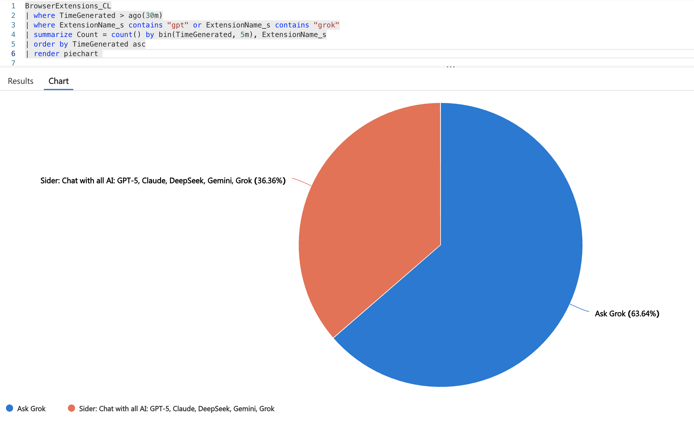
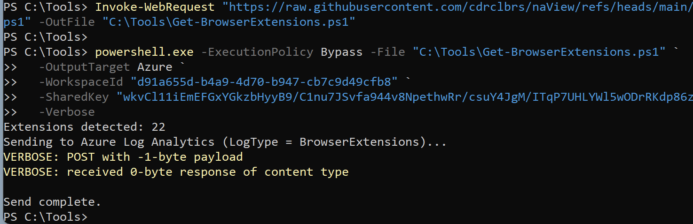
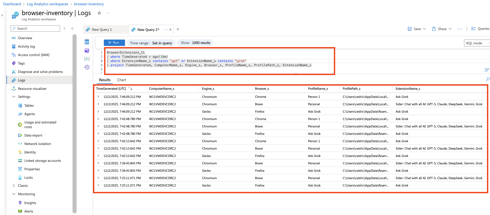

# naView - Get Browser Extensions
Vue immediate des extensions de naviagteurs installées sur les differents profils machine.




Ce projet fournit un **système d’inventaire des extensions de navigateurs** basé sur PowerShell, capable de :

- Scanner les navigateurs les plus courants en entreprise  
  (Chrome, Edge, Firefox, Brave, Opera etc..bref du chrome based)
- Extraire les extensions installées pour chaque profil utilisateur local
- (Optionnel) Ne remonter que les extensions **ajoutées manuellement** par l’utilisateur
- Normaliser les données collectées
- Exporter les résultats :
  - **en local** (fichier JSONL)
  - **dans Azure Log Analytics** (mode recommandé)🚀
- Permettre un reporting centralisé via **Kusto Query Language (KQL)**

Ce script est adapté à :

- l’inventaire 
- la conformité et la sécurité des postes  
- l’analyse de surface d’attaque côté navigateur  
- le suivi des extensions potentiellement dangereuses 

---

## Fonctionnalités

### Navigateurs supportés

Le script détecte et analyse :

- Google Chrome (Stable / Beta / Dev / Canary)
- Microsoft Edge (Stable / Beta / Dev / Canary)
- Mozilla Firefox
- Brave Browser
- Opera / Opera GX  
- Autres navigateurs Chromium compatibles

### Métadonnées collectées

Pour chaque extension :

- Nom de la machine
- Utilisateur
- SID utilisateur
- Navigateur
- Nom du profil
- Extension ID
- Nom de l’extension
- Version
- Description
- Moteur (Chromium / Gecko)
- Timestamp
- Identifiant d’exécution du script (GUID)


### Filtrage des extensions “installées par l’utilisateur” (optionnel)

Si activé :

- **Chromium** : filtre via les métadonnées du fichier `Preferences` (extensions avec `install_type == "normal"` et non installées par défaut / OEM / composant).
- **Firefox** : ignore les extensions système (`isSystem`), cachées (`hidden`) et les types autres que `extension`.

### Modes de sortie

| Mode | Description |
|------|-------------|
| `--OutputTarget Local` | Écrit les données dans un fichier `.jsonl` local |
| `--OutputTarget Azure` | Envoie les données dans Azure Log Analytics via l’API Data Collector |

---

## Prérequis

### Exécution locale
- Windows 10 ou 11
- PowerShell 5.1 ou PowerShell 7+  
- Pas besoin de droits admin pour l’export local

### Mode Azure 🚀
- Un workspace Log Analytics
- Workspace ID
- Clé Shared Key

---

## Installation et exec

## Installation

Téléchargez le script :

```powershell
Invoke-WebRequest "https://raw.githubusercontent.com/cdrclbrs/naView/refs/heads/main/Get-BrowserExtensions.ps1" -OutFile "C:\Tools\Get-BrowserExtensions.ps1"
```
Utilisation

1. Mode Local

```powershell
.\Get-BrowserExtensions.ps1 
  -OutputTarget Local 
  -OutputPath "C:\Temp\extensions.jsonl" 
  -Verbose
```

2. Mode Azure Log Analytics

```powershell
Copy code
.\Get-BrowserExtensions.ps1 `
  -OutputTarget Azure `
  -WorkspaceId "<WORKSPACE-ID>" `
  -SharedKey "<SHARED-KEY>" `
  -Verbose
  ```
Filtraer sur les extensions Users installed only
```powershell
powershell.exe -ExecutionPolicy Bypass -File "C:\Tools\Get-BrowserExtensions.ps1" 
  -OutputTarget Azure 
  -WorkspaceId "d91a655d-b4xxxxxfb8" 
  -SharedKey "wkvCl11iEmEFGxYGxxxxxxxx6zn511Q==" 
  -UserInstalledOnly 
  -Verbose
  ```


## Exemple — Exécution du Script





## Intégration Azure Log Analytics

En mode Azure, le script envoie les données vers :

```
https://<WorkspaceId>.ods.opinsights.azure.com/api/logs?api-version=2016-04-01
```

Azure crée automatiquement la table :

```
BrowserExtensions_CL
```

Exemple :

| JSON | Colonne dans Azure |
|------|--------------------|
| `"Browser": "Chrome"` | `Browser_s` |
| `"Timestamp": "2025-12-02T14:05:00Z"` | `Timestamp_t` |
| `"RunId": "…" ` | `RunId_g` |

---

## Exemple — Reporting Azure (Kusto Query)





---

## Exemples de requêtes Kusto (KQL)

### 1. Extensions des machines contenant "S1TEST", Chrome Stable, version < 1.4

```kusto
BrowserExtensions_CL
| where ComputerName_s contains "S1TEST"
| where Browser_s == "Chrome"
| where BrowserChannel_s == "Stable"
| extend verParts = split(Version_s, ".")
| extend major = toint(verParts[0]),
         minor = toint(iif(array_length(verParts) > 1, verParts[1], "0"))
| where major < 1 or (major == 1 and minor < 4)
| project TimeGenerated, ComputerName_s, User_s, Browser_s,
          ExtensionId_s, ExtensionName_s, Version_s
| order by ComputerName_s asc, ExtensionName_s asc
```


## Support & Contribution

Pull requests evidement bienvenues 
Pour toute demande d’amélioration, utilisez l’onglet **Issues** du dépôt GitHub